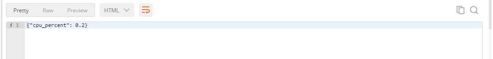
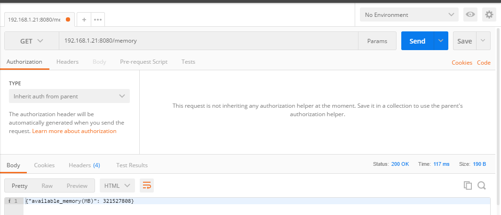
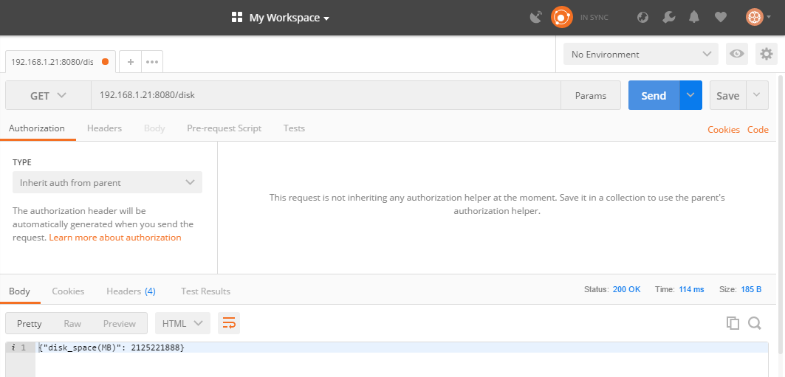
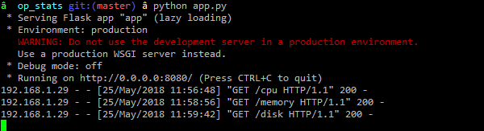
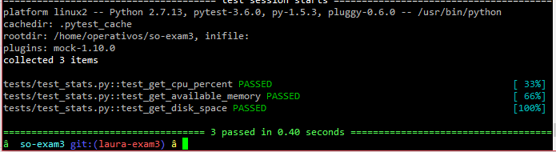
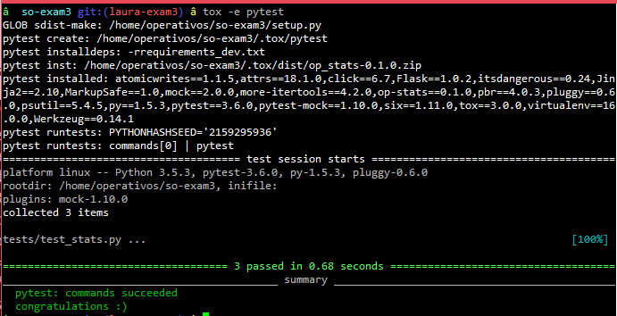
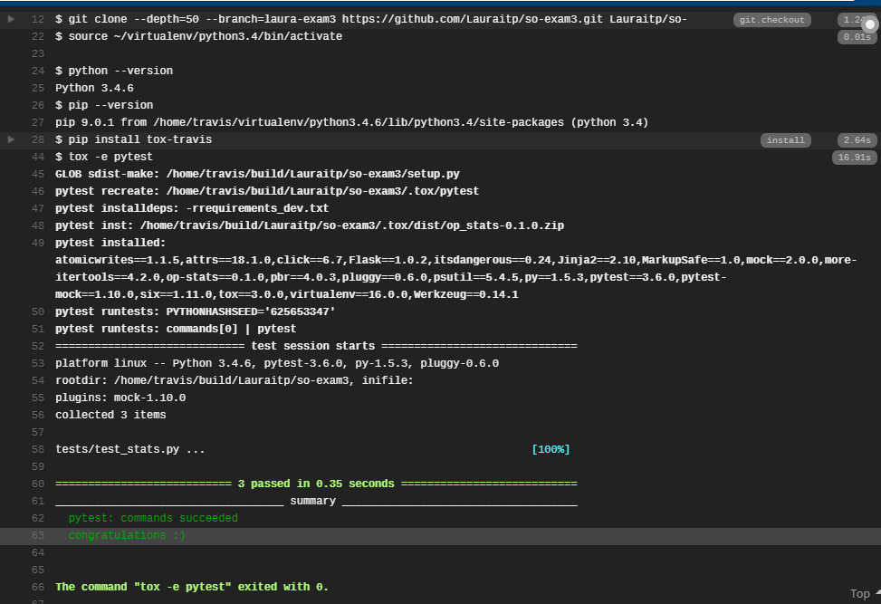

# so-exam3
**Nombre:** Laura Isabella Tabares Perez  
**Código:** A00054120  
**URL github:** https://github.com/Lauraitp/so-exam3/tree/laura-exam3  

____________

## punto 3: Implementar un servicio web en Flask

Para la impementación de este punto dese debe:   
1. crear una carpeta op_stats, en ella crear un archivo app.py y stats.py  
En el archivo stats.py debe ir lo siguiente:  

```Console
import psutil

class Stats():

  @classmethod
  def get_cpu_percent(cls):
    cpu_percent = psutil.cpu_percent()
    return cpu_percent

  @classmethod
  def get_available_memory_ram(cls):
    available_memory = psutil.virtual_memory().available
    return available_memory

  @classmethod
  def get_hard_disk_space(cls):
    disk_space = psutil.disk_usage('/').free
    return disk_space
```  

**NOTA:** Es importante tener instalada psutil.

Por otro lado en app.py debe ir:  

```Console
from flask import Flask
import json

import sys
sys.path.append('/home/operativos/so-exam3')

from op_stats.stats import Stats

app = Flask(__name__)

@app.route('/cpu')
def get_cpuinfo():
    cpu_percent = Stats.get_cpu_percent()
    return json.dumps({'cpu_percent': cpu_percent})

@app.route('/memory')
def get_memoryinfo():
    memory_info = Stats.get_available_memory_ram()
    return json.dumps({'available_memory(MB)': memory_info})

@app.route('/disk')
def get_diskinfo():
    disk_info = Stats.get_hard_disk_space()
    return json.dumps({'disk_space(MB)': disk_info})


if __name__ == '__main__':
    app.run(host='0.0.0.0',port=8080)
```

Para correr los dos archivos, primero se debe seguir el siguiente comando:  
```Console
python stats.py
```  
Y a continuaciòn: :  
```Console  
python app.py  
```
Para luego abrir Postman, que los descarè en  la siguinete pàgina: https://www.getpostman.com/  
En la aplicación de postman se debe ir al adirección con la que se ingresó a Putty, en mi caso 192.168.1.21 con el puerto 8080 y la dirección cpu, para ver solo el consumo de la misma.    


para la memoria RAM disponible es: 192.168.1.21:8080/memory  
  

Y por último para el espacio disponible en el disco: 192.168.1.21:8080/disk
  
  


  

## Punto 4: Implemente las pruebas unitarias para los servicios empleando Fixtures y Mocks.  

Para las pruebas unitarias, se implementa las siguientes lineas dcòdigo en el archivo test_stats.py de la carpeta tests:

```Console  
import pytest
import sys
sys.path.append('/home/laura-exam3/so-exam3')

from op_stats.app import app
from op_stats.stats import Stats

@pytest.fixture
def client():
  client = app.test_client()
  return client

def test_get_cpu_percent(mocker, client):
  mocker.patch.object(Stats, 'get_cpu_percent', return_value=100)
  response = client.get('/cpu')
  assert response.data.decode('utf-8') == '{"cpu_percent": 100}'
  assert response.status_code == 200

def test_get_available_memory(mocker, client):
  mocker.patch.object(Stats, 'get_available_memory_ram', return_value=2000)
  response = client.get('/memory')
  assert response.data.decode('utf-8') == '{"available_memory(MB)": 2000}'
  assert response.status_code == 200


def test_get_disk_space(mocker, client):
  mocker.patch.object(Stats, 'get_hard_disk_space', return_value=1000)
  response = client.get('/disk')
  assert response.data.decode('utf-8') == '{"disk_space(MB)": 1000}'
  assert response.status_code == 200  
```  

**Nota:**  instalar todos los paqueres de requierements.txt  

A continuaciòn se puede ver como ha funcionado con el comando:
```
pytest -v
```
  


Por ùltimo, se ejecuta el comando tox para que las pruebas se ejecuten en un entorno virtual.  
```Console 
tox -e pytest
```  

  

## Punto 5: Emplee un servicio de integracíon continua que haga uso de las pruebas unitarias desarrolladas para validar sus commits.  

Para ingresar a Travis hay que acceder a la siguiente direcciòn: https://travis-ci.org/ e iniciar sesiòn con nuestra cuenta de github.   
Luego buscamos el repositorio al que le queremos hacer las pruebas de integraciòn, el cual es so-exam3.  
  
y lo activamos.

Lo primero que realiza travis cada vez que hay un commit en nuestri repositorio es un archivo con nombre .travis.yml donde se nombran las dependencias necesarias.  
```Console  
sudo: false
language: python
notifications:
  email: false
python:
- '3.4'
install: pip install tox-travis
script: tox -e pytest  
``` 

Luego ejecuta el archivo setup.py  
```Console  
from setuptools import setup, find_packages

setup(
    name='op_stats',
    version='0.1.0',
    packages=['op_stats'],    
    install_requires=[
        'flask',
        'psutil'
    ]
)  
```  
Para crear un paquete con el nombre de nuestra carpeta op_stats y las dos dependencias importantes: flask y psutil.  

Por último se ejecuta le archivo tox.ini  
```Console  
[tox]
envlist = pytest 

[testenv]
basepython = python3

[testenv:pytest]
deps =
  -rrequirements_dev.txt
commands =
  pytest
```  
Que ejecuta lo que se encuentra en requirements_dev.txt y el comando pytest.  
Para ver si pasaron las pruebas.




